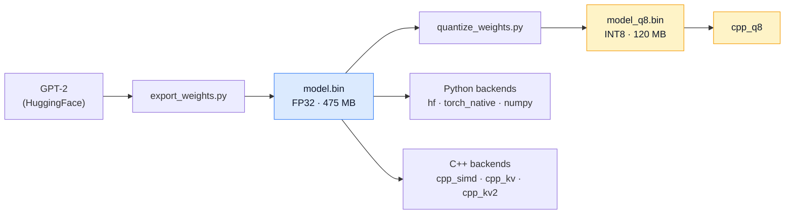

# GPT-2 Inference Engine — From Scratch

The same GPT-2 weights, 7 implementations — from pure NumPy to INT8-quantized
SIMD C++ with KV caching. All of them produce **identical output** under greedy
decoding.

## Backends

```
cpp_kv        ████████████████████████████████████████ 130   C++ · SIMD + KV cache
cpp_kv2       ██████████████████████████████████████   125   C++ · + zero-alloc + op fusion
cpp_q8        ████████████████████████████              92   C++ · INT8, 4x smaller
cpp_simd      ███████████████                           48   C++ · Accelerate BLAS + NEON
torch_native  ██████████                                31   Python · hand-written PyTorch
hf            ████████                                  27   Python · transformers
numpy         █                                          4   Python · pure NumPy
                                                    tok/sec
```

*Apple Silicon, 100 tokens, greedy decoding.*

The KV cache is the single biggest win — 2.7x on its own. Zero-alloc and op
fusion on top of it (`kv2`) did not pay off; INT8 trades throughput for a 4x
smaller model.

Not charted: the naive triple-loop C++ baseline runs at **0.5 tok/sec**, so
BLAS + NEON alone is a ~95x end-to-end speedup. Add `--include-naive` to
benchmark it (100 tokens takes about three minutes).

## Quick Start

```bash
# 1. Setup
python -m venv .venv && source .venv/bin/activate
pip install torch transformers numpy

# 2. Export weights (creates weights/model.bin + vocab.bin)
python export_weights.py

# 3. Quantize to INT8 (creates weights/model_q8.bin, 475MB → 120MB)
python quantize_weights.py

# 4. Build C++ backends (macOS only)
cd cpp && make && cd ..

# 5. Run one backend
python main.py --backend hf --prompt "Hello world" --max_length 50

# 6. Benchmark all of them
python main.py --compare --prompt "The meaning of life is" --max_length 100
```

### Larger models

Nothing is hardcoded to GPT-2 small — every backend reads its dimensions from
the `model.bin` header, so any GPT-2 size works:

```bash
python export_weights.py --model_name gpt2-medium --output_dir weights_medium
python main.py --compare --weights weights_medium/model.bin
```

Verified on `gpt2-medium` (355M, 24 layers, 1024d): all backends still agree.

## Architecture



```
core/         interfaces, sampler, shared binary weight loader
backends/     hf_backend.py · torch_native_backend.py · numpy_backend.py
cpp/          main.cpp + one model_*.h per variant, built by Makefile
weights/      model.bin · model_q8.bin · vocab.bin  (generated, gitignored)
```

## Key Optimizations

| Optimization | File | Impact |
|---|---|---|
| `cblas_sgemm` BLAS | `model_simd.h` | ~23× faster matmul vs naive |
| `vvexpf` / `vvtanhf` + NEON | `model_simd.h` | Vectorized transcendentals, 4-wide element-wise |
| KV Cache | `model_kvcache.h` | Process 1 token/step instead of T |
| Zero-alloc + fused softmax | `model_kvcache_v2.h` | Pre-allocated scratch, single pass over scores |
| INT8 per-channel quantization | `model_q8_kv.h` | 4× compression, NEON dequant |

## INT8 Quantization

Per-row absmax quantization with NEON-accelerated dequantization:

```
scale = max(|row|) / 127
q[i]  = round(row[i] / scale)   → int8
```

475 MB → 120 MB (3.97×), RMSE 0.0014, and identical output to FP32 under greedy
decoding.

## License

MIT — see [LICENSE](LICENSE). GPT-2 weights are from OpenAI via HuggingFace and
carry their own license.
