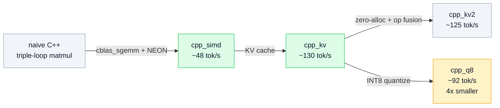
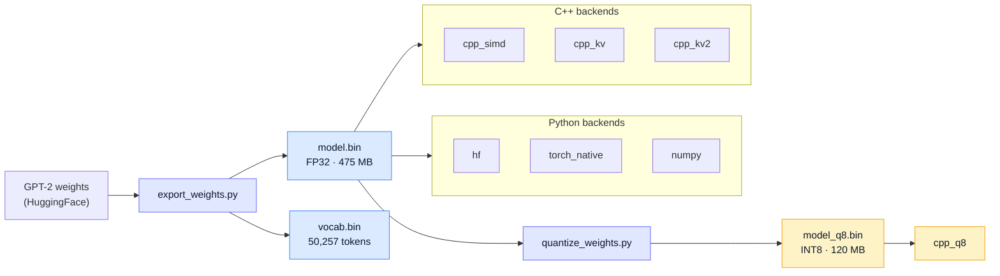
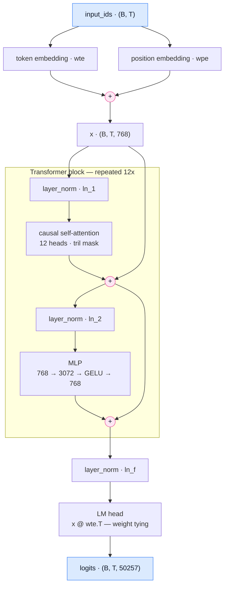
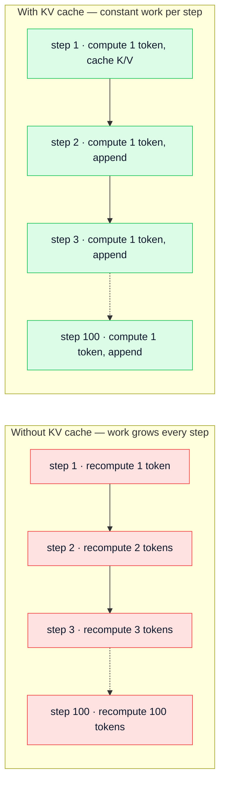

# GPT-2 Inference Engine — From Scratch

A multi-backend GPT-2 inference engine built from the ground up. The same model weights power **7 different implementations**, from high-level Python to INT8-quantized SIMD C++ with KV caching.

## Backends

| Backend | Language | Description | tok/sec |
|---------|----------|-------------|--------:|
| **hf** | Python | HuggingFace `transformers` library | ~27 |
| **torch_native** | Python | Hand-written PyTorch (no library inference) | ~31 |
| **numpy** | Python | Pure NumPy — no PyTorch at runtime | ~4 |
| **cpp_simd** | C++ | Apple Accelerate BLAS + ARM NEON | ~48 |
| **cpp_kv** | C++ | SIMD + KV Cache | ~130 |
| **cpp_kv2** | C++ | KV Cache + Zero-Alloc + Op Fusion | ~125 |
| **cpp_q8** | C++ | **INT8 Quantized** + KV Cache (4x smaller) | ~92 |

```
cpp_kv        ████████████████████████████████████████ 130
cpp_kv2       ██████████████████████████████████████   125
cpp_q8        ████████████████████████████              92
cpp_simd      ███████████████                           48
torch_native  ██████████                                31
hf            ████████                                  27
numpy         █                                          4
                                                    tok/sec
```

*Benchmarked on Apple Silicon, 100 tokens, greedy decoding.*

### How each optimization stacks up



The KV cache is the single biggest win — a 2.7x jump on its own. The `kv2`
zero-alloc and fusion work did **not** pay off on top of it (~125 vs ~130):
once the cache is in place, allocation is no longer the bottleneck. INT8 trades
throughput for a 4x smaller model.

## Quick Start

```bash
# 1. Setup
python -m venv .venv && source .venv/bin/activate
pip install torch transformers numpy

# 2. Export weights (creates weights/model.bin + vocab.bin)
python export_weights.py

# 3. Quantize to INT8 (creates weights/model_q8.bin, 475MB → 120MB)
python quantize_weights.py

# 4. Build C++ backends (macOS only)
cd cpp && make && cd ..

# 5. Run single backend
python main.py --backend hf --prompt "Hello world" --max_length 50

# 6. Benchmark all backends
python main.py --compare --prompt "The meaning of life is" --max_length 100
```

## Project Structure

```
├── LICENSE                    # MIT
├── main.py                    # Entry point + cross-backend benchmark
├── export_weights.py          # GPT-2 → weights/model.bin + vocab.bin
├── quantize_weights.py        # model.bin → model_q8.bin (INT8 per-channel)
├── core/
│   ├── interfaces.py          # TokenizerInterface, TransformerEngineInterface
│   ├── sampler.py             # Temperature sampling / greedy decoding
│   └── weight_loader.py       # Shared binary weight loader
├── backends/
│   ├── hf_backend.py          # HuggingFace GPT2LMHeadModel wrapper
│   ├── torch_native_backend.py  # Hand-coded PyTorch GPT-2
│   └── numpy_backend.py       # Pure NumPy GPT-2
├── cpp/
│   ├── main.cpp               # C++ entry point (all variants)
│   ├── model.h                # Naive C++ (triple-loop matmul)
│   ├── model_simd.h           # SIMD: cblas_sgemm + NEON + vvexpf/vvtanhf
│   ├── model_kvcache.h        # SIMD + KV Cache
│   ├── model_kvcache_v2.h     # + Zero-Alloc hot path + Operator Fusion
│   ├── model_q8_kv.h          # INT8 quantized + KV Cache + NEON dequant
│   ├── encode_text.py         # Tokenize text for C++ input
│   └── Makefile               # Builds: gpt2, gpt2_fast, gpt2_kv, gpt2_kv2, gpt2_q8
└── weights/                   # Generated by export/quantize scripts
    ├── model.bin              # FP32 weights (475 MB)
    ├── model_q8.bin           # INT8 weights (120 MB, 3.97x smaller)
    └── vocab.bin              # BPE vocabulary (50,257 tokens)
```

## Architecture

All backends share the same weight files and produce **identical output** under greedy decoding (including INT8).



### Forward pass

Pre-LN transformer, 12 blocks, with the LM head tied to the token embedding.



The two `+` nodes inside the block are the residual connections — note that the
normalization sits *inside* each branch, not on the residual path.

### Why the KV cache wins

Without a cache, every step re-runs attention over the whole prefix. With one,
each step computes a single token and appends its K/V to the cache.



## Key Optimizations

| Optimization | File | Impact |
|---|---|---|
| `cblas_sgemm` BLAS | `model_simd.h` | ~23× faster matmul vs naive |
| `vvexpf` / `vvtanhf` | `model_simd.h` | Vectorized transcendentals |
| ARM NEON intrinsics | `model_simd.h` | 4-wide SIMD element-wise ops |
| KV Cache | `model_kvcache.h` | Process 1 token/step instead of T |
| Zero-Alloc hot path | `model_kvcache_v2.h` | Pre-allocated gelu scratch buffers |
| Fused scale+mask+softmax | `model_kvcache_v2.h` | Single pass over attention scores |
| INT8 per-channel quantization | `model_q8_kv.h` | 4× model compression, NEON dequant |

## INT8 Quantization

Per-row absmax quantization with NEON-accelerated dequantization:

```
For each weight row:  scale = max(|row|) / 127
                      q[i] = round(row[i] / scale)     → int8
                      row'[i] = q[i] * scale            → dequantized fp32
```

- **Compression**: 475 MB → 120 MB (3.97×)
- **Precision**: RMSE = 0.0014, max per-element error < 0.07
- **Output**: Identical to FP32 under greedy decoding on GPT-2

## License

MIT — see [LICENSE](LICENSE).

Educational project. GPT-2 weights are from OpenAI via HuggingFace and carry
their own license; the MIT license here covers this repository's code only.
